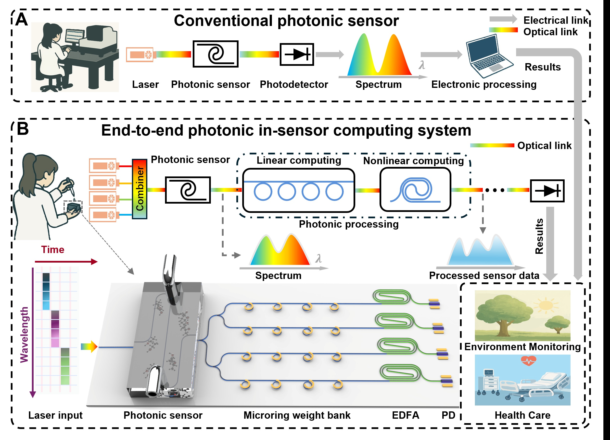

# End-to-End All-Optical In-Sensor Computing System Using Photonic Integrated Circuits

This repository provides the data and code associated with our manuscript:

**"End-to-end all-optical in-sensor computing system using photonic integrated circuits"**

Authors: Zian Xiao, Zhihao Ren, Yangyang Zhuge, Zixuan Zhang, Yan Yang, Bowei Dong, and Chengkuo Lee  


<p align="center">
  
</p>

## Abstract

Photonic sensors play an increasingly important role in chemical analysis, but conventional photonic sensing systems typically rely on sequential wavelength scanning, full spectral readout, and extensive electronic post-processing. This sensing-storage-then-compute workflow generates large data redundancy and leads to increased latency and energy consumption.

Here, we introduce an end-to-end all-optical in-sensor computing system based on photonic integrated circuits. The system integrates a photonic waveguide sensor and a microring resonator weight bank on a single chip to perform sensing and linear optical computation within the same photonic acquisition pathway. Nonlinear activation is implemented using an erbium-doped fiber amplifier, enabling optical-domain neural-network inference before final electronic readout.

By performing task-specific spectral compression and feature extraction directly in the optical domain, the proposed system reduces intermediate data storage, data transfer, and separated electronic post-processing. The system achieves up to 6-bit computing precision, 94.2% classification accuracy across 27 liquid-mixture classes, and concentration prediction for mixed chemicals. Compared with conventional photonic sensing systems, the proposed architecture reduces inference latency by a factor of 4.48 and energy consumption by a factor of 11.47.

These results establish a compact, low-redundancy, and energy-efficient paradigm for intelligent photonic sensing at the edge.

## Main Concept

---> The proposed system directly integrates photonic sensing and photonic neural-network computation.

---> A photonic waveguide sensor captures wavelength-dependent molecular absorption information from liquid mixtures.

---> A microring resonator weight bank performs optical-domain linear weighting and spectral compression.

---> An erbium-doped fiber amplifier provides nonlinear activation through optical gain saturation.

---> The final output is read by a photodetector after optical-domain sensing and computing, reducing intermediate electronic storage and data transfer.

## Repository Contents

```text
.
├── Chip_control/             # Python code to feedback control chip and python to find look-up table
├── Dataset/          # Sensor signal dataset
├── Figures-raw data/             # Raw data used in the manuscript
├── Figures-tiff/          # Figures in the manuscript
├── README.md         # Description of this repository
└── LICENSE           # License information
